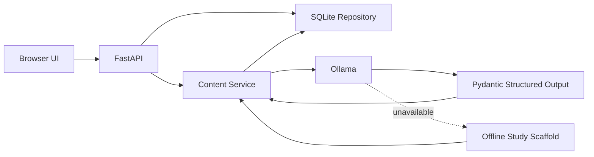

# Local AI Learning Tutor

A local-first learning application that turns a topic into a structured curriculum, generates concept-rich lessons with a local Ollama model, and stores progress locally with SQLite.

The project is designed around learning quality rather than generic text generation. Study guides include prerequisites, learning outcomes, section objectives, and key concepts. Each generated lesson is validated against a structured schema containing explanations, intuition, examples, a worked problem, common mistakes, practice questions, hints, answers, and takeaways.

When Ollama is unavailable, the application stays usable but intentionally switches to an **offline study scaffold** instead of presenting generic template text as expert teaching.

## What this project demonstrates

- FastAPI API design with typed request and domain validation
- Local LLM integration through Ollama
- Structured LLM outputs validated with Pydantic
- Difficulty-aware curriculum and lesson generation
- Graceful degradation when the local model runtime is unavailable
- SQLite persistence for sessions, content caching, and learning progress
- Separation between API, persistence, model integration, and domain logic
- Deterministic automated tests that do not require an LLM
- Docker packaging and GitHub Actions CI
- Safe browser rendering without injecting raw model HTML

## Architecture



### Project structure

```text
.
├── app/
│   ├── main.py                # FastAPI application and routes
│   ├── config.py              # Environment-backed configuration
│   ├── database.py            # SQLite repository layer
│   ├── schemas.py             # Requests + structured learning schemas
│   ├── services/
│   │   ├── content.py         # Curriculum and lesson orchestration
│   │   └── ollama.py          # Optional Ollama integration
│   └── static/                # Browser UI
├── tests/                     # Deterministic API/domain tests
├── .github/workflows/ci.yml   # Lint, format, test, and Docker checks
├── Dockerfile
├── docker-compose.yml
├── requirements.txt
└── requirements-dev.txt
```

## Learning-quality design

### Curriculum generation

A study guide is not just a list of generic section names. The model must return:

- prerequisites
- measurable learning outcomes
- exactly six sequenced sections
- section-specific learning objectives
- section-specific key concepts
- realistic study-time estimates

### Lesson generation

Every model-generated lesson is structured into:

- overview
- why the section matters
- at least three core concepts
- explanation + intuition + example for each concept
- a worked example with explicit steps
- common mistakes
- at least three practice questions
- hints and answers
- key takeaways

The backend asks Ollama for JSON matching a Pydantic JSON schema and validates the response before rendering it. This makes lesson structure more reliable than free-form prompt output. If strict structured generation fails while Ollama is still reachable, the tutor retries once with model-generated Markdown before falling back to the offline scaffold.

### Difficulty levels

- **Easy:** plain language, analogies, defined terminology, simple examples
- **Medium:** practical technical depth, realistic examples, useful trade-offs
- **Hard:** rigorous mechanisms, assumptions, edge cases, and technical detail

## Features

- Generate six-section study plans for arbitrary topics
- Easy, medium, and hard learning levels
- Higher-quality local model selection by preference order
- Structured, validated lesson generation
- Cache generated curricula and lessons in SQLite
- Regenerate individual lessons on demand
- Track completed sections and accumulated study time
- Restore progress with a browser session cookie
- Continue operating in offline study-scaffold mode when Ollama is not running
- Automatically invalidate old cached content when the content-generation version changes

## Quick start

### 1. Clone the repository

```bash
git clone https://github.com/ankitkarwasara5/AI_tutor.git
cd AI_tutor
```

### 2. Create a virtual environment

```bash
python3 -m venv .venv
source .venv/bin/activate
```

### 3. Install dependencies

For normal use:

```bash
python -m pip install --upgrade pip
pip install -r requirements.txt
```

For development and testing:

```bash
pip install -r requirements-dev.txt
```

### 4. Start Ollama

The application can boot without Ollama, but full teaching content requires a local model.

```bash
ollama serve
```

For a good quality/speed balance on a capable local machine, install one of the preferred models. The application uses the first installed model from `PREFERRED_MODELS`.

```bash
ollama pull qwen3:8b
ollama list
```

A lighter option is:

```bash
ollama pull gemma3:4b
```

### 5. Run the application

```bash
uvicorn app.main:app --reload --host 127.0.0.1 --port 8000
```

Open:

```text
http://127.0.0.1:8000
```

Interactive API documentation:

```text
http://127.0.0.1:8000/docs
```

## Configuration

Copy the example configuration if you want to override defaults:

```bash
cp .env.example .env
```

Key options:

| Variable | Default | Purpose |
| --- | --- | --- |
| `DATABASE_PATH` | `data/learning_tutor.db` | SQLite database location |
| `OLLAMA_BASE_URL` | `http://localhost:11434` | Ollama server address |
| `OLLAMA_CONNECT_TIMEOUT_SECONDS` | `8` | Fast connectivity probe timeout |
| `OLLAMA_GENERATION_TIMEOUT_SECONDS` | `300` | Maximum lesson-generation time |
| `PREFERRED_MODELS` | quality-first local model list | Model selection order |
| `DISABLE_OLLAMA` | `false` | Force offline study-scaffold mode |
| `SESSION_TIMEOUT_SECONDS` | 30 days | Browser progress-session lifetime |

Default model preference order:

```text
qwen3:8b
llama3.1:8b
gemma3:4b
qwen3:4b
llama3.2:3b
```

You do not need to install every model. One is enough.

## API

| Method | Endpoint | Purpose |
| --- | --- | --- |
| `GET` | `/api/health` | Runtime/model health |
| `POST` | `/api/study-guide` | Create or retrieve a curriculum |
| `POST` | `/api/section-content` | Generate or retrieve a lesson |
| `POST` | `/api/regenerate-content` | Replace cached lesson content |
| `POST` | `/api/progress/update` | Persist progress and study time |
| `GET` | `/api/progress/{guide_hash}` | Retrieve saved progress |

## Testing

The automated test suite disables Ollama and uses an isolated temporary SQLite database so CI remains deterministic.

```bash
pytest -v
```

Run quality checks:

```bash
ruff check .
ruff format --check .
```

Or use the Makefile:

```bash
make dev
make lint
make test
```

## Docker

Build the application image:

```bash
docker build -t local-ai-learning-tutor .
```

Or run with Compose:

```bash
docker compose up --build
```

The Compose configuration expects Ollama to run on the host and connects through `host.docker.internal`, keeping model acceleration outside the application container.

## Design decisions

**Quality-first local model selection.** The original prototype prioritized tiny models for latency. The current version prefers stronger 4B-8B local models first while retaining a 3B fallback.

**Structured outputs instead of loose JSON prompting.** Curriculum and lesson responses are constrained by Pydantic JSON schemas before they are accepted by the application.

**Learning objectives are passed into lesson generation.** The lesson model sees the section overview and objectives from the curriculum, reducing disconnected or generic section content.

**Cache versioning is explicit.** Prompt/schema changes update an internal content version, which changes cache hashes so stale low-quality lessons are not reused.

**Offline mode is honest.** Without a model, the application gives a study scaffold and does not invent subject-matter explanations.

**Database code is isolated.** Route handlers contain no SQL. The repository layer owns schema initialization, caching, sessions, and progress persistence.

**Tests do not call an LLM.** Automated tests verify deterministic application behavior and the structured lesson renderer without nondeterministic model calls.

**Generated text is rendered safely.** The browser builds DOM nodes rather than injecting model output as raw HTML.

## Manual quality evaluation

A local model can be nondeterministic, so automated endpoint tests are not enough. See `MANUAL_TESTING.md` for a repeatable quality check using easy, medium, and hard topics.

## Roadmap

- Add optional source-grounded learning from uploaded documents
- Add streaming lesson generation
- Add per-question answer reveal and scoring
- Add exportable study plans
- Add browser-level end-to-end tests
- Add a small evaluation set for local-model lesson quality

## License

MIT

## Generation timeout and fallback behavior

Model discovery and model generation use different timeouts. A quick `/api/tags` or
`client.list()` call can succeed in a few seconds while an 8B model may need much longer
to produce a full lesson on local hardware. The tutor therefore uses an 8-second
connectivity probe and a 300-second generation timeout by default.

For Qwen3 structured output, thinking is disabled to reduce latency and keep JSON
responses easier to validate. If the strict JSON-schema response is invalid, the tutor
retries with a full AI-generated Markdown lesson. Only after both model attempts fail
does it use the deterministic offline scaffold.

## Ollama connection recovery

The tutor automatically retries the Ollama connection when a learning request arrives.
If the application started before Ollama, you no longer need to restart FastAPI once
Ollama becomes available.

Check runtime status:

```bash
curl http://127.0.0.1:8000/api/health
```

A healthy AI-backed session reports `"mode": "ollama"`, `"model_available": true`,
and the `active_model`. If Ollama is offline, the response also exposes
`ollama_error` and the configured `ollama_base_url` for troubleshooting.

You can also force an immediate reconnect:

```bash
curl -X POST http://127.0.0.1:8000/api/ollama/reconnect
```

Offline scaffolds are not treated as permanent content. When a local model becomes
available, previously cached offline material is replaced automatically on the next
request. Content cache keys are versioned so quality upgrades do not reuse stale
lessons generated by older prompt/schema versions.
